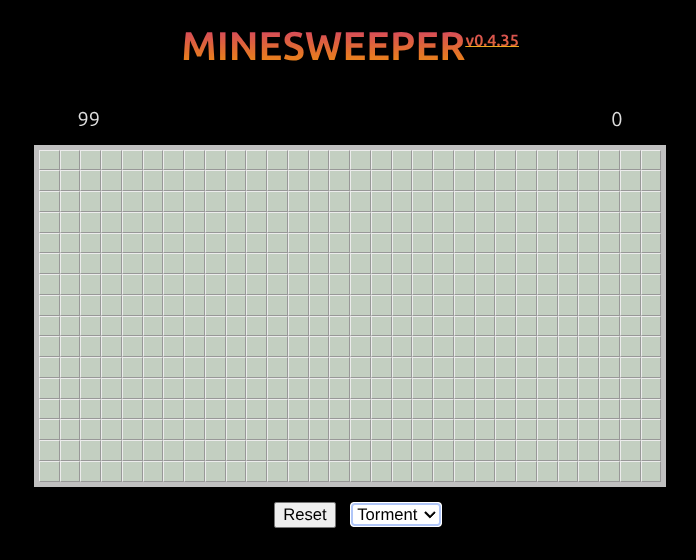

# Play Minesweeper Online for Free
[](https://app.netlify.com/sites/mnswpr/deploys)

Play it here: [mnswpr.com](https://mnswpr.com). This is the classic game **Minesweeper** built with vanilla web technologies (i.e., no framework dependency).

<!-- TODO: replace with the actual screenshot/GIF once supplied (confirm final path/filename) -->


Technology Stack: HTML, JS, and CSS; [Google Firebase](https://firebase.google.com) for leader board store; [Netlify](https://netlify.com) for hosting

## Usage

The web is a wonderful, free, and open platform to create and distribute value. You can use **mnswpr** in different ways:

- as a deployed [web app](https://mnswpr.com)
- as a [library](https://npmx.dev/package/@ayo-run/mnswpr) with `npm i @ayo-run/mnswpr`
- as a `web component` (coming soon).

Using it as a library takes only a few lines — mount it onto any element by `id`:

```js
import '@ayo-run/mnswpr/mnswpr.css'
import mnswpr from '@ayo-run/mnswpr'

const game = new mnswpr('app')
game.initialize()
```

## How to Play

The goal is to reveal every safe cell without detonating a mine. Your **first click is always safe**.

- **Left click** — reveal a cell
- **Right click** — flag / unflag a suspected mine
- **Left + right click together** (chording) — reveal the neighbors of a satisfied number
- **Touch** — tap to reveal, long-press to flag

## Tooling
The project has gone through years of existence. It started from 2019 when tooling was massively different. I have [modernized it](https://elk.zone/social.ayco.io/@ayo/116333804543330938) since and have witnessed how much easier and faster it is to build now - even without web frameworks or LLMs!

As of now the tooling I use are:
- [Vite](https://vite.dev/) for bundling and development server
- [Eslint](https://eslint.org) for JS linting & [CSS linting](https://eslint.org/blog/2025/02/eslint-css-support/)
- [ESLint Stylistic](https://eslint.style) for JS formatting
- [Husky](https://typicode.github.io/husky/) for git hooks
- [PNPM](https://pnpm.io/installation) for dependency & workspace management
- and a bunch of automation using scripts and Continuous Integration actions

Because a big part of this project's purpose is to track how the software development industry evolves — and because it has come a long way in modernizing along the way — I now also use it as a **playground for coding agents**. It's a small, framework-free, well-scoped codebase, which makes it a great sandbox to see how AI agents read, reason about, and change real code. To help them get their bearings quickly, the repo ships an [`AGENTS.md`](./AGENTS.md) describing the architecture and conventions.

## Development
To start development, you need [`node`](https://nodejs.org/en/download). I highly recommend [`pnpm`](https://pnpm.io/installation) to be used as well. Once you know you have this, you can do the following:
1. Install dependencies: `pnpm i`
2. Start the dev server: `pnpm run dev`

The rest of the everyday commands:

```bash
pnpm test        # run the Vitest suite
pnpm lint        # ESLint (JS + CSS)
pnpm lint:fix    # ESLint with autofix
pnpm build       # build the website
pnpm build:lib   # build the publishable library
```

## Contributing

Contributions are welcome! See [`AGENTS.md`](./AGENTS.md) for the architecture, conventions, and release workflow before opening a pull request.

## You just want to play?

*👉 The live site is here: [mnswpr.com](https://mnswpr.com)*

## Background
One day, while working in my home office, I heard loud and fast mouse clicks coming from our bedroom. It's my wife, playing her favorite game (Minesweeper) on a crappy website full of advertisements.

I can't allow this, it's a security issue. 🤣

But it is also an opportunity.

I wanted to give her the same game, with a similar leader board she can dominate. And this is also a chance for me to dig deeper into vanilla JS.

Can I make a page with complex interactions (more on this later) without any library dependency?

## What I have learned:
1. JS is awesome ✨
1. We don't always *need* JS frameworks (or TS) ✨
1. Even subtle UI changes *can improve* user gameplay experience ✨
1. There's more ways to break your app than you are initially aware of ✨
1. Competition motivates users to use your app more ✨
1. Hash in bundled filenames helps avoid issues with browser caching (when shipping versions fast) ✨


## License

[BSD-2-Clause](./LICENSE)

---

_Just keep building._<br>
_A project by [Ayo](https://ayo.ayco.io)_
